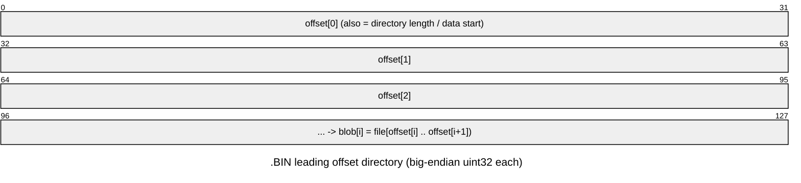

# `.BIN` — sprite banks

Loriciel-custom raster banks used by `BUMSPJEU.BIN` (game sprites) and `FLECHE.BIN`
(the world-map level-select cursor arrow). Each file opens with a directory of
**big-endian `uint32`** byte offsets; each entry delimits one blob, spanning from its
offset to the next (last entry → EOF).



| File | Bytes | Dir entries | First offset | Blob size(s) |
|------|------:|------------:|-------------:|--------------|
| `FLECHE.BIN` | 2188 | 1 | `0x0C` | 2176 (single arrow frame) |
| `BUMSPJEU.BIN` | 89116 | — | `0x0C` | see below |

## `BUMSPJEU.BIN` — flat frame-offset table + data section

`BUMSPJEU.BIN` is a flat **BE32 frame-offset table** starting at offset `0`, followed
by a data section at a fixed base of `0x800`:

```
table  @0x000   BE32 entries; each value is an offset relative to the data base 0x800
data   @0x800   per-frame [12-byte header | packed pixels]
```

Frame `i`'s pixel data begins at `file[0x800 + table[i]]`. The 12-byte header
immediately **precedes** that pointer:

| Header field | Offset from pixel pointer | Type | Meaning |
|---|---|---|---|
| `ctrl` | −0x0a (−10) | byte | codec flags; `ctrl & 0x40` selects mask-RLE |
| `width` | −4 | BE16 | row width in **16-bit words** |
| `height` | −2 | BE16 | row count |

The pixel pointer itself is the first byte of packed pixel data.

## Pixel format — 4-plane planar, 16px blocks

Raw frames (`ctrl & 0x40 == 0`) encode pixels in interleaved 16-pixel blocks, one
block per four `width` words:

```
row    = `width` BE16 words = (width / 4) blocks of 16 px
block  = [plane0_word, plane1_word, plane2_word, plane3_word]   (MSB = leftmost pixel)
pixel  = sum_p( (plane_p >> (15 − col)) & 1 ) << p   for p in 0..3
```

Sprite dimensions in pixels: `(width / 4) * 16` wide × `height` rows. Palette index
`0` is transparent.

One frame in `BUMSPJEU.BIN` uses the `ctrl & 0x40` **mask-RLE** variant: a
`(width * height) >> 2` byte bitmask precedes the packed pixels; a set bit copies
a pixel, a clear bit produces transparency.

## `FLECHE.BIN`

`FLECHE.BIN` holds a single frame: directory entry `[0] = 0x0C`, so the pixel pointer
is at file offset `0x80C`. The header gives `width = 4` words (16 px) and
`height = 16` rows — a 16×16 cursor arrow. It decodes with the same 4-plane
block-planar reader. Palette: MONDE1's embedded 16-colour palette (index 13 body,
14 edge; 0 transparent).

## Decoded by

- `tools/extract/sprite_sheet.py` — decodes all raw frames of `BUMSPJEU.BIN` to a
  PNG sprite sheet.
- `tools/extract/sprite_container.py` — maps the flat frame-offset table (prints
  per-frame offsets and header fields).
- `tools/extract/render_fleche.py` — decodes `FLECHE.BIN` to
  `results/sprites/fleche_arrow.png` (plus an 8× upscale).
- `tools/extract/binbank.py` — extracts raw blobs from any `.BIN` file.
