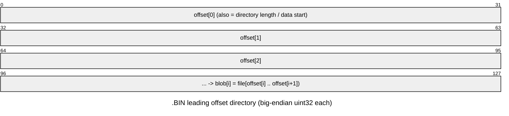

# `.BIN` — sprite / image banks

Loriciel-custom raster banks: `FLECHE.BIN` (the level-select arrow, "flèche") and
`BUMSPJEU.BIN` ("BUMpy SPrites JEU" = game sprites). A `.BIN` opens with a
directory of **big-endian `uint32`** byte offsets into the file; each entry's
blob runs to the next offset (last → EOF).



| File | Bytes | Dir entries | First offset | Blob size(s) |
|------|------:|------------:|-------------:|--------------|
| FLECHE.BIN | 2188 | 1 | 0x0C | 2176 (single arrow sprite) |
| BUMSPJEU.BIN | 89116 | 3* | 0x0C | 132, 132, 88840* |

### `BUMSPJEU.BIN` — flat frame-offset table + data section (CORRECTED)

The earlier "4-level offset tree" reading was wrong (those repeating 132-byte steps are
just frame records). It is a **flat BE32 frame-offset table + a data section at 0x800**:

```
table @0       BE32 entries; each is an offset RELATIVE to the data base 0x800
data  @0x800   per-frame [12-byte header | packed pixels]
frame i pixels = file (0x800 + table[i]);  its 12-byte header precedes that pointer
```

Verified against the runtime: the loader resolves `table[i]` → far ptr `base+0x800+off`
(seed sheet base `0x4eae0`), and the op12 seed's p1 frame 0 lands at file `0x80c`,
dims 4×16 — matching `0x800 + table[0](=0xc)`. `tools/extract/sprite_container.py` walks
the flat table; `tools/extract/sprite_oracle.py` drives the real decoder per frame.

Header = BE16 words at `frame_ptr-0xc..frame_ptr`: `width@-4` (in **16-bit words per
row**), `height@-2` (rows), plus a `ctrl` byte (`@-0xa`); BE in-file.

### Pixel format — CRACKED (raw frames, pure-Python)

A raw frame (`ctrl & 0x40 == 0`, ~all frames) is **4-plane planar, interleaved in 16px
blocks**:

```
row = `width` BE16 words = (width/4) blocks of 16 px
block = [plane0_word, plane1_word, plane2_word, plane3_word]   (MSB = leftmost px)
pixel = sum_p ((plane_p >> (15-col)) & 1) << p     # 0 = transparent
sprite is (width/4 * 16) px wide x `height` rows
```

e.g. frame 33 (world-map Bumpy-on-cloud): width=8 words → 32 px, height=21. Validated
visually against the user's `results/oracle/bumpy_oracle.png` and the emulator capture.
`tools/extract/sprite_sheet.py` decodes **511/512 frames** to `results/sprites/
bumspjeu_sheet.png` (Bumpy animations, teddy bears, conveyor/awning pieces, candy/food,
a full 0–9/A–Z sprite font, etc.) using the level (world-1) palette; 0 = transparent.

The one remaining frame uses `ctrl & 0x40` = **mask-RLE** (`mask_count=(w*h)>>2` bitmask
bytes then packed pixels; set bit→copy, clear→transparent), expanded at runtime by
`prepare_sprite_frames` via the bit-reverse LUT `pixel_bitrev_lut`. The live blit
(`blit_sprite_vga` → codegen `FUN_203b_f8fd/f87d`) rearranges this into a column-major
form for plotting, but that rearrangement is **not needed** — the file frames decode
directly with the block-planar reader above. (Emulator capture + background-diff,
`sprite_isolate.py`/`sprite_crop.py`/`sprite_separate.py`, was used to obtain the
ground-truth Bumpy/cloud that validated the format.)

## Extraction

- `tools/extract/sprite_sheet.py` → `results/sprites/bumspjeu_sheet.png` (all frames, pure-Python).
- `tools/extract/sprite_container.py [file.BIN]` — map the flat frame-offset table.
- `tools/extract/binbank.py <file.BIN>` → raw blobs in `build/extract/bin/<name>/`.
- `tools/extract/render_fleche.py` → `results/sprites/fleche_arrow.png` (+`_8x`). `FLECHE.BIN`
  is one frame: dir `[0]=0xc` → data base `0x800`, frame_ptr `0x80c`, **width=4 words (16px),
  height=16** → a 16×16 cursor arrow (the world-map level-select pointer). Decodes with the
  same 4-plane block-planar reader as `BUMSPJEU`; coloured with MONDE1's embedded palette
  (index 13 body, 14 edge; 0 transparent).
