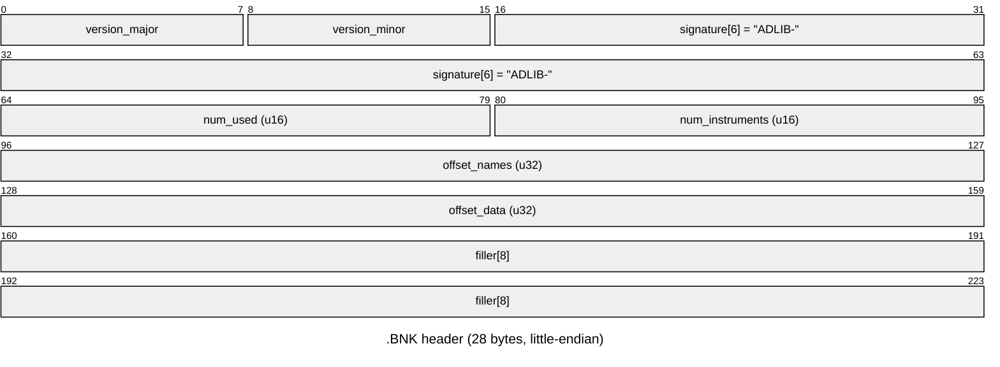

# `.BNK` — AdLib OPL2 instrument bank

`BUMPY.BNK` is a **standard AdLib Inc. instrument bank**, *not* a Loriciel-custom
format: little-endian, `ADLIB-` signature — the same layout read by AdPlug, DOSBox's
OPL bank loaders, and other OPL2 tools. It holds the FM "timbres" (voice patches) that
the game's MIDI music engine assigns to OPL2 channels; see [MID.md](MID.md) for how
`BUMPY.MID` selects them.

## Header (28 bytes, little-endian)



| Field | Type | `BUMPY.BNK` value | Meaning |
|---|---|---|---|
| `version_major` / `version_minor` | `u8`, `u8` | `1` / `0` (→ "v1.0") | bank format version |
| `signature` | `char[6]` | `"ADLIB-"` | fixed magic |
| `num_used` | `u16` LE | `129` | count of name-index entries with `used=1` |
| `num_instruments` | `u16` LE | `160` | total name-index entries (used + free) |
| `offset_names` | `u32` LE | `0x1c` (28) | file offset of the name index (immediately after the header) |
| `offset_data` | `u32` LE | `0x79c` (1948) | file offset of the instrument-data array |
| `filler` | `byte[8]` | all `0x00` | unused padding |

Bytes 0–1 are `01 00`, bytes 2–7 are `41 44 4c 49 42 2d` (`"ADLIB-"`), confirming the
version + signature; `num_used`/`num_instruments`/`offset_names`/`offset_data` above
were read directly from the header at `00000000`–`0000001c` (`xxd`-verified).

## Name index @ `offset_names` (12 bytes/entry × `num_instruments`)

| Field | Type | Meaning |
|---|---|---|
| `index` | `u16` LE | slot number into the instrument-data array (see below) — **not** the entry's own position in this table |
| `used` | `u8` | `1` if the slot holds a real instrument, `0` if free |
| `name` | `char[9]` | instrument name, NUL-padded (not always NUL-terminated at full length) |

An instrument's 30-byte register record lives at
`offset_data + index * 30` (i.e. `index` addresses the *data* array, independent of
the entry's position in the *name* table). Example, table position 0 (first name-index
entry): `index=27, used=1, name="rol000"` → data record at `0x79c + 27*30 = 0xac6`.

Of the 160 entries, table positions `0..128` (129 entries — exactly `num_used`) are
`used=1` and named sequentially **`rol000` … `rol128`** (the `rol0NN` scheme). Table
positions `129..159` (31 entries) are `used=0`; three retain a truncated leftover name
with the first character overwritten by `-` (`-ol015_`, `-ol016_`, `-ol048_` — remnants
of `rol015_`/`rol016_`/`rol048_`, presumably a bank-editor "delete slot" marker), the
rest have an all-NUL name field. These free slots are inert data; nothing in the
engine reads them.

## Instrument record (30 bytes) @ `offset_data + index * 30`

Each instrument is a 30-byte OPL2 two-operator (modulator + carrier) FM voice-patch
block — sound-characteristics, scaling/output level, attack/decay, sustain/release,
and wave-select for each operator, plus feedback/connection — the standard AdLib
register-patch layout shared by the `.BNK`/`.IBK` family (see AdPlug or a DOSBox OPL
bank reader for the authoritative per-byte register mapping; `bnkbank.py` does not
further decode it). Sample (`rol025_`, slot `0`, file offset `0x79c`):

```
00 00 00 01 05 0f 01 00 02 0d 11 00 00 00 01 00 01 62 0f 08 00 05 06 00 00 00 00 01 00 00
```

## Decoded by

- `tools/extract/bnkbank.py <file.BNK>` — parses the header + name index, writes
  `instruments.csv` (index, used, name, data offset) and one raw 30-byte
  `NNN_<name>.sbi.raw` per instrument to `local/build/extract/bnk/<name>/`. No custom
  decoder is needed beyond this: the format is the published AdLib one, so any
  existing OPL2/`.BNK` tool (AdPlug, etc.) can also read it directly.

  On `BUMPY.BNK`:
  ```
  BUMPY.BNK    ver=1.0 sig='ADLIB-' used=129 total=160 names@0x1c data@0x79c -> 129 named, .../BUMPY.BNK/
     sample instruments: rol000, rol001, rol002, rol003, rol004_, rol005_, rol006_, rol007_, rol008_, rol009_, rol010_, rol011_
  ```
