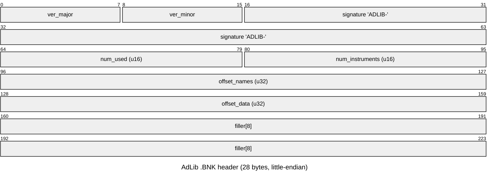

# `.BNK` — AdLib OPL2 instrument bank (standard format)

`BUMPY.BNK` is **not** a Loriciel-custom format: it is the published **AdLib Inc.
instrument-bank (`.BNK`)** format (little-endian, `ADLIB-` signature) — the same
one AdPlug/adplug and other OPL2 tools already read. Prefer existing tooling for
playback; the parser here just exposes the contents.

| Off | Size | Field | Value (BUMPY.BNK) |
|----:|-----:|-------|-------------------|
| 0 | 1 | version major | 1 |
| 1 | 1 | version minor | 0 |
| 2 | 6 | signature | `"ADLIB-"` |
| 8 | 2 | num_used | 129 |
| 10 | 2 | num_instruments | 160 |
| 12 | 4 | offset_names | `0x1C` |
| 16 | 4 | offset_data | `0x79C` |
| 20 | 8 | filler | — |

**Name index** @ `offset_names` — `num_instruments` records of 12 bytes:

| Off | Size | Field |
|----:|-----:|-------|
| 0 | 2 | `index` (into instrument-data array) |
| 2 | 1 | `used` flag |
| 3 | 9 | name (NUL-padded, e.g. `rol000`) |

**Instrument data** @ `offset_data` — 30-byte OPL2 register records (modulator +
carrier parameters: KSL, multiple, feedback, ADSR, waveform, …), the standard
AdLib instrument layout consumable directly by OPL tooling.

The 129 used instruments are named `rol000…rol128` — the stock AdLib General-MIDI
bank (Roland-derived). A reimplementation can simply ship/point at a standard
AdLib GM bank rather than re-deriving these.

## Extraction

`tools/extract/bnkbank.py BUMPY.BNK` →
- `build/extract/bnk/BUMPY.BNK/instruments.csv` (index, used, name, data offset)
- `build/extract/bnk/BUMPY.BNK/NNN_<name>.sbi.raw` (raw 30-byte OPL2 records)

## Related: `.MID`

`Bumpy.mid` is a **Standard MIDI File** (format 1, 7 tracks, 192 ticks/quarter).
Play/convert with any SMF tool (timidity, fluidsynth, `mido`). Not re-implemented.
