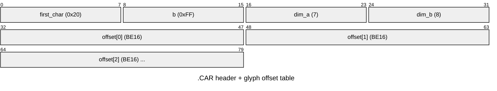

# `.CAR` — bitmap font ("caractères")

`DDFNT2.CAR` — a proportional bitmap font. A 4-byte header followed by a table of
**big-endian `uint16`** glyph offsets; each glyph's bitmap spans
`[offset[i], offset[i+1])`.

| Field | Value (DDFNT2) | Meaning |
|-------|----------------|---------|
| `first_char` | `0x20` (space) | code of the first glyph |
| `b` | `0xFF` | last code / count marker |
| `dim_a × dim_b` | `7 × 8` | nominal cell size (cols × rows); glyphs are proportional |
| offset table | BE16 × N | per-glyph byte offsets into the file |

126 table entries. **`table[0]` is a phantom** (a 198-byte blob, not a glyph), so the
real glyphs are shifted by one: **char `C` → table index `C - first_char + 1`**.

### Per-glyph layout — CONFIRMED

Each glyph blob is:

| Bytes | Meaning |
|-------|---------|
| `0` | `width` (pixels, ≤ 8) |
| `1` | `height` (rows) |
| `2` | `0x00` (pad) |
| `3 .. 3+height` | bitmap: one byte per row, 8 px wide, **MSB = leftmost**, top `width` columns used |
| last 2 | trailer (advance/kerning; not needed to render) |

Blob size = `3 + height + 2`, so the 12/10/6/4-byte spread is just per-glyph height
(variable-width *and* variable-height/proportional). The two giant blobs (198/399 B)
are the phantom entry and one special slot.

Rendering chars `0x20..0x7e` this way produces a fully legible ASCII sheet (digits,
upper/lower case, punctuation) — see `results/images/ddfnt2_sheet.png`.

## Extraction

- `tools/extract/car_sheet.py [file.CAR] [out.png]` → a PNG font sheet (pure Python).
- `tools/extract/carfont.py DDFNT2.CAR` → raw per-glyph blobs in `build/extract/car/`.

## Status

Header + glyph directory + **bitmap bit-layout: confirmed** (legible sheet rendered).
