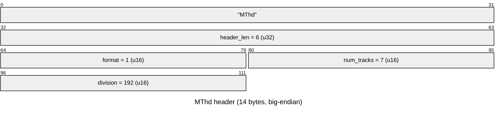

# `.MID` — Standard MIDI File (music sequence)

`BUMPY.MID` is a plain **Standard MIDI File (SMF)** — format 1, 7 tracks, division
192 ticks/quarter-note. There is **no Loriciel container**: the file is
byte-for-byte a standard `.mid` and can be played, converted, or inspected with any
off-the-shelf SMF tool (timidity, fluidsynth, a DAW, `mido`, …). It carries the
melody/harmony data; the actual OPL2 timbres it's rendered through come from
[`BUMPY.BNK`](BNK.md).

## Header (`MThd`, 14 bytes)

`xxd` of `Bumpy.mid` bytes `0x00`–`0x0d`: `4d54 6864 0000 0006 0001 0007 00c0` —
`"MThd"`, header length `6`, format `1` (multiple simultaneous tracks sharing one
tempo map), `7` tracks, division `0x00c0` = `192` ticks per quarter note.

## Track chunks (`MTrk`)

Each track is a standard `MTrk` chunk: 4-byte tag, `u32` big-endian byte length,
then a stream of `<delta-time varlen> <event>` pairs. `BUMPY.MID`'s 7 tracks:

| # | Length (bytes) | File offset | Content |
|--:|---------------:|------------:|---------|
| 0 | 19 | `0x0e` | conductor track: time signature (`FF 58`, 4/4), tempo (`FF 51`, 0x0c3500 µs/qtr ≈ 75 BPM), end-of-track |
| 1 | 12569 | `0x29` | channel-prefix + text-name meta `"xylo    "`, then note events |
| 2 | 8613 | `0x314a` | text-name meta `"harpsi  "` |
| 3 | 5208 | `0x52f7` | text-name meta `"bass2   "` |
| 4 | 682 | `0x6757` | text-name meta `"bells   "` |
| 5 | 7949 | `0x6a09` | text-name meta `"pompe   "` |
| 6 | 31 | `0x891e` | text-name meta `"programs"` — a short program-change-only track |

Tracks 1–5 each open with a `FF 01` (Text Event) meta giving an 8-byte, space-padded
instrument label (a composer/tracker-tool annotation, not a `BUMPY.BNK` slot name —
the labels don't correspond 1:1 to `rol0NN` names). Track 0 carries only the
global tempo/time-signature meta and no notes; track 6 is a minimal program-setup
track. These are ordinary SMF meta-events (`0xFF <type> <varlen-length> <data>`); a
generic parser can skip any it doesn't recognize.

## How the engine consumes it

The MIDI music engine (`src/midi.c`, under reconstruction) walks the file with a
straightforward SMF sequencer, mirroring the on-disk chunk/event structure above:

1. **`midi_parse_file`** (`1000:8809`) — validates `MThd`/reads format, track count,
   and division, then walks each `MTrk` chunk.
2. **`midi_init_track_table`** (`1000:87a2`) — sets up one track-state entry per
   `MTrk` (read cursor, running status, next event time) for all 7 tracks.
3. Per track, the sequencer repeatedly calls:
   - **`midi_read_varlen`** (`1000:8891`) — decodes an SMF variable-length quantity
     (delta-time or meta/sysex length; 7 bits/byte, MSB = continuation), the same
     VLQ encoding used throughout the file (e.g. the header's own extensions, and
     every event's delta-time).
   - **`midi_process_event`** (`1000:873c`) — decodes the next MIDI/meta event at
     the cursor and dispatches it: channel voice messages (note on/off, program
     change, …) are routed to the OPL2 voice-emission path
     (`opl_event_note_on` → the OPL2 driver in `src/sound.c`, selecting the FM patch
     from the loaded `BUMPY.BNK` instrument bank — see [BNK.md](BNK.md)) or, if the
     MPU-401 device is selected, out via `midi_emit_voice_msg_w1/w2/w3`; meta events
     (tempo, time signature, track/text names, end-of-track) update sequencer state.

A PIT tempo timer (`midi_install_tempo_timer`, `1000:86e9`) advances the sequence
tick-by-tick over wall-clock time, calling `midi_process_event` once the next
event's due time is reached. These functions (plus the surrounding `midi_*`/`seq_*`
call tree — track counting, far-pointer normalization, per-channel parameter setup,
voice-message emission) are named in the live Ghidra project and are being
reconstructed into `src/midi.c` in later tasks; this doc only covers the on-disk
file format and the shape of the consuming call chain.

## Decoded by

No custom tool is needed — `BUMPY.MID` is a standard SMF; any MIDI-capable player,
converter, or library (timidity, fluidsynth, `mido`, a DAW) reads it as-is. The
track/meta-event table above was produced with a small ad-hoc `struct`-based Python
scan (chunk header + `FF <type>` meta walk); no such script is checked in, since the
file needs no project-specific decoding.
