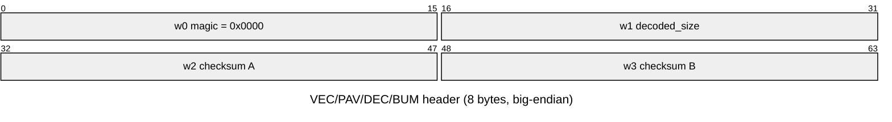

# Bumpy's Arcade Fantasy — data file formats

Loriciel title; French names: `monde`=world, `pavé`=tile/paving, `décor`=scenery,
`fleche`=arrow, `caractères`=characters/font.

Extraction scripts live in `tools/extract/`.

## File-type map

| Ext | Per-level | Kind | Endian | Doc |
|-----|-----------|------|--------|-----|
| `.VEC` | no (shared) | Vector-graphics command stream | **big** | [VEC.md](VEC.md) |
| `.PAV` | yes (`D1..D9`) | Level playfield/tiles (vector stream) | **big** | [PAV.md](PAV.md) |
| `.DEC` | yes (`D1..D9`) | Level décor/background (vector stream) | **big** | [DEC.md](DEC.md) |
| `.BUM` | yes (`D1..D9`) | Level objects/masks (vector stream) | **big** | [BUM.md](BUM.md) |
| `.BIN` | no | Sprite/image bank (offset directory) | **big** | [BIN.md](BIN.md) |
| `.CAR` | no | Bitmap font ("caractères") | **big** | [CAR.md](CAR.md) |
| `.BNK` | no | **Standard AdLib OPL2 instrument bank** (`ADLIB-` signature, little-endian) | little | [BNK.md](BNK.md) |
| `.MID` | no | **Standard MIDI** (format 1, 7 trk, 192 tpqn) | — | [MID.md](MID.md) |

`.VEC/.PAV/.DEC/.BUM` are the **same container** (below), all consumed by the same
interpreter (`vec_run`, overlay segment `1c28`). `.BNK` is the published AdLib Inc.
instrument-bank format readable by AdPlug/adplug and other OPL2 tools (see
[BNK.md](BNK.md) for the header/name-index layout and the `rol0NN` instrument
naming). `.MID` is a standard MIDI file — play or convert with timidity,
fluidsynth, or any SMF tool; see [MID.md](MID.md) for the track layout and how the
engine's MIDI sequencer consumes it.

## The shared container (VEC/PAV/DEC/BUM)

8-byte big-endian header, then a body of big-endian 16-bit words that the
interpreter reads as a command stream.

| Off | Size | Field | Meaning |
|----:|-----:|-------|---------|
| 0 | 2 | `w0` magic | always `0x0000` |
| 2 | 2 | `w1` decoded_size | output/render-buffer size hint in bytes (≈32000 for a full 320×200 16-colour screen; `0` in `SCORE.VEC`) |
| 4 | 2 | `w2` checksum A | validation word (checked by the record reader) |
| 6 | 2 | `w3` checksum B | validation word |

The header is actually the first **record**: the body is a short sequence of
records, each a 12-byte big-endian header (`w0..w3` params, `w4` opcode+flag,
`w5` = `w0^w1^w2^w3^w4` XOR checksum) followed by a variable inline data blob.
Record 0 is always `op4` with `w0=0`, `w1=decoded_size`. The per-record checksum
makes the whole stream **walkable in pure Python** (no emulation):
`tools/extract/vec_records.py` covers 98.5–100 % of every file. See
[VEC.md](VEC.md) for the record layout and interpreter.

## Per-level data

The per-level `.PAV` / `.DEC` / `.BUM` set decodes into the buffers that make up a
playable puzzle (the brush/tile atlas, the per-level map-header table, and the
background tile grid). See [LEVELS.md](LEVELS.md) for the decoded-buffer layouts,
the `0xc2`-byte level-header structure, and how the three combine.
