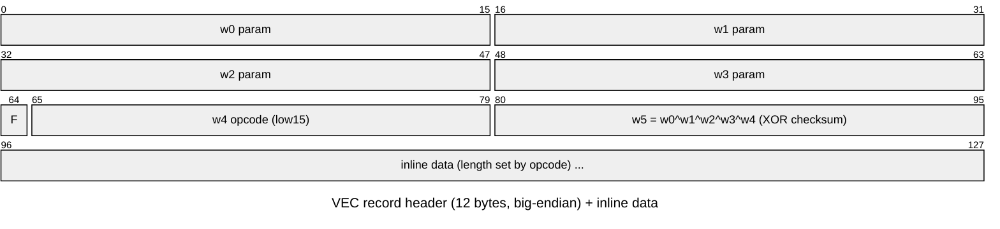

# `.VEC` — vector-graphics command stream

The primary graphics format. Files: `TITRE` (title), `SCORE` (HUD glyphs),
`MONDE1..9` (the 9 worlds), `BUMPRESE` (the "Bumpy's Arcade Fantasy" **presentation/
splash** screen — Bumpy + logo + LORICIEL © 1992), `MASKBUMP` (the **EASY/MEDIUM/HARD
difficulty-select UI** — a partial-screen overlay; the name's "mask" likely refers to
its menu-box masks), `DESSFIN` (ending). Shares the
[8-byte container header](README.md#the-shared-container-vecpavdecbum) with `.PAV/.DEC/.BUM`.

> **Decode-buffer size.** All `.VEC` screens decode into the **full-screen 0x7d63 buffer**
> (99-byte header + 320×200 4-plane planar @ 99, embedded 16-colour palette @ 51), even
> the partial ones whose container `w1` (`decoded_size`) is smaller (BUMPRESE `w1=0x4b6c`,
> MASKBUMP `w1=0xd1e`). `w1` is the *content* size; you must still bound the decode to
> 0x7d63 or the in-place op12 hits the `vec_run_7e` marker-2 (`dstend>dst2`) early-out and
> aborts, leaving the buffer un-decompressed. `vec_to_png.py` always uses 0x7d63.
> `render_vec_images.py` renders all eight non-level screens (TITRE/SCORE/DESSFIN/BUMPRESE/
> MASKBUMP) → `results/images/`, plus MONDE1..9 → `results/levels_png/world<n>.png`.

A `.VEC` is **not** a bitmap — it is a stream of drawing commands executed by the
in-EXE interpreter `vec_run` (overlay segment `1c28`; `docs/05`). It renders into
a planar VGA buffer.

## Interpreter model

```
vec_run(stream, len, x0, y0):          # FUN_1c28_0000
  current_point = (x0, y0)
  (clipX, clipY) = vec_xform(setup)    # FUN_1cda_0000, AX selector
  loop:
    vec_read_record()                  # FUN_1c28_0a09 — decode current record; CF=1 => stop
    if carry: return
    opcode = field4 & 0x7fff
    table[opcode-1]()                  # dispatch @ DGROUP 0x4e37; handler advances stream + draws
    current_point = last_point
    while opcode > 0
```

Key globals (all DGROUP / Ghidra seg `203b`):

| Global | Role |
|--------|------|
| `0x4e0e/0x4e10` | stream pointer (offset / segment) |
| `0x4e0a/0x4e0c` | clip limits (x / y), seeded from `vec_xform` |
| `0x4e28/0x4e2a` | current point (x / y) |
| `0x4e33/0x4e35` | last-read point |
| `0x4e1e/0x4e20` | decoded operand words |
| `0x4e31` | current opcode (low15) |
| `0x4e22` | current colour / pen |
| `0x4e37` | **opcode dispatch table** (near offsets into seg `1c28`) |

`vec_read_record` reads the record as **big-endian** words (every read does
`xchg al,ah`), decodes operand fields, validates, and returns carry to stop. It
does **not** advance the stream pointer — each opcode handler does.

## Record encoding (confirmed, pure-Python verifiable)

A `.VEC` body is a small sequence of **records** (5–11 per file). Each record is a
12-byte header of six big-endian `uint16` words followed by a variable-length
**inline data blob** (the graphics for that primitive):



| Word | Field | Meaning |
|------|-------|---------|
| `w0..w3` | params | primitive parameters (position / size / mode); record 0 has `w0=0`, `w1=decoded_size` |
| `w4` | opcode + flag | low 15 bits select the primitive (the dispatch uses `w4 & 0x3f`); bit `0x8000` (`F`) is a per-record flag |
| `w5` | **XOR checksum** | `w0 ^ w1 ^ w2 ^ w3 ^ w4` — self-validates every record |

The checksum makes the stream **walkable without emulation**: validate a record,
then scan word-aligned for the next position that validates; the gap is the
record's inline-data length. `tools/extract/vec_records.py` does exactly this and
covers **98.5–100 %** of every `.VEC/.PAV/.DEC/.BUM` file (record 0 is always
`op4`). The remaining bytes are trailing padding; `SCORE.VEC` and one `.BUM`
use a zeroed-header variant that needs a special case.

> Supersedes an earlier draft of this doc that modeled the body as a `<0x10`
> opcode / `≥0x10` coordinate token stream — that was a coincidental misread; the
> real unit is the checksum-validated record above.

`vec_xform` (`FUN_1cda_0000`, called with a selector in `AX`):

| AX selector | Returns |
|-------------|---------|
| coordinate | transform (x,y) → **planar-VGA byte address** (`>>3` = ÷8, 8 px/byte) + clip test |
| `0x000c` | pointer to the next stream byte (operand fetch) |
| `0x0400` | a 1 KB scratch buffer |
| entry `+0x45` | secondary address calc |

## Opcode dispatch table (@ DGROUP `0x4e37`)

Near offsets into overlay seg `1c28`; index = `opcode-1`; `0xffff` terminates.
Confirmed so far:

| Opcode | Handler | Behaviour |
|-------:|---------|-----------|
| 4 | `1c28:0194` | **set colour/pen** — reads a byte from the stream into `0x4e22` |
| 12 | `1c28:04b0` | **plot with clip** — `vec_xform` the point, clip vs `0x4e0a/0x4e0c`, compute planar byte address (`÷8`), read pattern/colour, write |
| others (1–3,5–11,13–15) | `1c28:0193` (`ret`) | no-op in the title/HUD render path |

> Note: the per-file **opcode histograms** (`tools/extract/container.py`) show
> opcodes 1–15 all occurring in `MONDE*`/`D*.PAV` bodies, so additional handlers
> are wired up in other render modes/overlays than the title path sampled above.
> Decoding every opcode's operand layout (line vs fill vs blit) is the remaining
> work — best finished by **emulating `vec_run` on a real file** (we have the
> unicorn harness from unpacking) and tracing its planar-VGA writes.

## Empirical (from real files)

`container.py` over all 14 `.VEC`:
- `w1 decoded_size` tracks file size and approaches `~0x7d00` (≈32000 =
  320×200×4bpp/2) for full-screen `TITRE`; `SCORE.VEC` is the outlier (`w1=0`,
  checksums `0`) — likely stored pre-decoded.
- Bodies are coordinate-dense (5–10k coordinate words) with opcodes interspersed
  — consistent with filled polygon / polyline world art.

## Decode pipeline — VALIDATED (pure Python, pixel-exact)

For full-screen images the real structure is simpler than the record walker
suggested: a single 12-byte `op4` header (`w1 = decoded_size`) followed by an
**RLE-compressed** payload (the `op4` handler `FUN_1c28_0194` is an RLE
decompressor). The "records" the checksum walker finds after record 0 are mostly
coincidental 16-bit-checksum hits inside the compressed stream, not real records.

1. **RLE-decompress** from offset 12 to `decoded_size` bytes. Escape = first byte:
   - `b != escape` → literal `b`
   - `escape, x, count` → `x` × `count` (**`count == 0` means 256**; `x != escape`)
   - `escape, escape` → one literal escape byte
2. The decompressed buffer = a small leading **header** (`decoded_size − 32000`,
   e.g. 99 bytes — zeros + some coords, *not* the palette) followed by a
   **320×200 16-colour EGA image as 4 sequential bitplanes** (4 × 8000 bytes,
   plane `p` bit `p` of each pixel).
3. **Palette**: stored **in the decoded buffer** — the 48 bytes immediately
   before the planar data are the 16-colour palette as RGB **6-bit** DAC triples
   (`(v<<2)|(v>>4)` to 8-bit). For `TITRE`: 51 bytes metadata, palette @51, planar
   @99. So the decoder is fully self-contained — no screenshot needed.

`tools/render/vec_render.py` does the planar+palette step. `tools/extract/vec_to_png.py`
is the **universal** standalone decoder (handles both the op4-only screens above and
the op12 record-stream screens below) — see next section.

## Record-stream full-screen images (`MONDE*`, etc.) — SOLVED

`MONDE<n>.VEC` (the 9 world maps), and screens like `DESSFIN`/`SCORE`, are **also
full-screen 320×200 images** — they just reach the final framebuffer through the full
record interpreter instead of a bare RLE blit:

1. `op4` RLE-decompress (as above) yields a **vec-record stream**, not planar pixels.
2. `vec_run` walks the 12-byte records and dispatches handlers; for these screens the
   stream is one `op4` record then an `op12` (masked-blit) record. `op12` composites
   the final image **in place** into the buffer.
3. The resulting buffer is `0x7d63` (32099) bytes = the **same layout as the TITRE
   screens**: a 99-byte header (16-colour palette = 16 × 6-bit-RGB triples **at offset
   51**) followed by the **320×200 4-plane planar image at offset 99**.

So the palette is self-contained in every full-screen `.VEC`; the game uploads it to
the VGA DAC in `level_intro_screen` (→ `upload_vga_dac_palette`, the DAC port writer).
There is **no display roll** — an earlier `DX=168` "correction" was an artifact of
reading the planar at offset 0 instead of 99.

Pure-Python pipeline (zero emulator): `tools/extract/op12_port.py` is the byte-exact
port of `op4` + `vec_run` + `op12`; `tools/extract/vec_to_png.py` runs it and emits a
PNG using the embedded palette. Validated **99.95% pixel-exact** vs a real DOSBox
screenshot (`results/oracle/world1_dosbox.png`); the remaining 0.05% is the live
HUD/score/sprite overlay. `tools/extract/render_vec_images.py` batch-renders all of
them. (`recover_palette.py` / screenshot correlation is no longer needed — the palette
is in the data.)

## Open

- **`.PAV/.DEC/.BUM` level resources** decode through the same `op4`+`vec_run` path but
  build runtime *structures* (collision/decor/object data), not a single full-screen
  image — the live gameplay screen is composited from sprites + entities at run time
  (still emulator-rendered via `render_levels.py`).
- **Sprites** (`BUMSPJEU.BIN`) and **fonts** (`DDFNT2.CAR`) — separate extractors (next).
