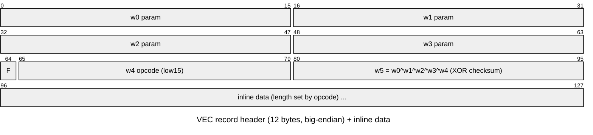

# `.VEC` — vector-graphics command stream

Files: `TITRE` (title screen), `SCORE` (HUD glyphs), `MONDE1..9` (the 9 worlds),
`BUMPRESE` (presentation/splash screen — Bumpy + logo + LORICIEL © 1992),
`MASKBUMP` (difficulty-select UI — a partial-screen overlay), `DESSFIN` (ending
screen). Shares the [8-byte container header](README.md#the-shared-container-vecpavdecbum)
with `.PAV/.DEC/.BUM`.

A `.VEC` file is a stream of drawing commands executed by the interpreter
`vec_run` (overlay segment `1c28`). It renders into a planar VGA buffer.

## Decode-buffer size

All `.VEC` screens decode into the **full-screen 0x7d63 buffer** (99-byte header +
320×200 4-plane planar at byte 99, embedded 16-colour palette at byte 51), even
partial-screen files whose container `w1` (`decoded_size`) is smaller (e.g.
`BUMPRESE` `w1=0x4b6c`, `MASKBUMP` `w1=0xd1e`). `w1` is the content size; the
decode buffer must still be allocated to 0x7d63, or the in-place blit terminates
early and leaves the buffer incompletely rendered. `tools/extract/vec_to_png.py`
always uses 0x7d63.

`tools/extract/render_vec_images.py` batch-renders all eight non-level screens
(`TITRE`/`SCORE`/`DESSFIN`/`BUMPRESE`/`MASKBUMP`) and `MONDE1..9`.

## Record encoding

A `.VEC` body is a small sequence of **records** (5–11 per file). Each record is a
12-byte header of six big-endian `uint16` words followed by a variable-length
**inline data blob** (the graphics payload for that primitive):

| Word | Field | Meaning |
|------|-------|---------|
| `w0..w3` | params | primitive parameters (position / size / mode); record 0 has `w0=0`, `w1=decoded_size` |
| `w4` | opcode + flag | low 15 bits select the primitive (the dispatch uses `w4 & 0x3f`); bit `0x8000` (`F`) is a per-record flag |
| `w5` | **XOR checksum** | `w0 ^ w1 ^ w2 ^ w3 ^ w4` — self-validates every record |

The checksum makes the stream **walkable without emulation**: validate a record,
then scan word-aligned for the next position that validates; the gap is the
record's inline-data length. `tools/extract/vec_records.py` does exactly this and
covers **98.5–100 %** of every `.VEC/.PAV/.DEC/.BUM` file. Record 0 is always
`op4`. The remaining bytes past the last record are trailing padding; `SCORE.VEC`
and some `.BUM` files use a zeroed-header variant that requires a special case.

## Interpreter model

The interpreter (`vec_run`) maintains a current-point and clip limits, then loops
reading records and dispatching to opcode handlers. The opcode dispatch table
lives at DGROUP offset `0x4e37` and holds near offsets into the overlay; index
is `opcode-1`; `0xffff` terminates the table. `vec_read_record` reads each record
as big-endian words and validates the XOR checksum before returning; termination
(carry flag set) occurs when any of:
- `w0 > 0x0f` (source-segment out of range — natural stream end)
- `w4 & 0x7f00 != 0` (opcode high bits set — invalid)
- `w5 != w0^w1^w2^w3^w4` (checksum mismatch)

`.DEC` streams end via the opcode-validity / checksum terminator (their terminal
record carries opcode `0x750`), not the `w0` check that ends `.PAV`/`.BUM`.

Key DGROUP globals used by the interpreter:

| DGROUP offset | Role |
|--------------|------|
| `0x4e0e/0x4e10` | stream pointer (offset / segment) |
| `0x4e0a/0x4e0c` | clip limits (x / y) |
| `0x4e28/0x4e2a` | current point (x / y) |
| `0x4e33/0x4e35` | last-read point |
| `0x4e1e/0x4e20` | decoded operand words |
| `0x4e31` | current opcode (low 15 bits) |
| `0x4e22` | current colour / pen |
| `0x4e37` | opcode dispatch table |

## Opcode handlers

Opcodes confirmed in the title/HUD render path:

| Opcode | Behaviour |
|-------:|-----------|
| 4 | **op4 RLE decompressor** — reads a byte from the stream as the escape byte, then decompresses the inline payload in place (see below) |
| 12 | **op12 masked blit** — composites the decompressed planar image into the output buffer using a per-pixel mask stream |
| others (1–3, 5–11, 13–15) | additional draw primitives present in `.PAV`/`.DEC` level files; operand layouts (line vs. fill vs. blit) are determined by opcode-specific handlers in other render paths |

## op4 RLE decompression algorithm

The escape byte `fill` is the byte at `stream+0x0C`. The payload follows at
`stream+0x0D`. Decoding to `decoded_size` bytes:

| Input pattern | Output |
|--------------|--------|
| `b` where `b != fill` | literal byte `b` |
| `fill, fill` | one literal `fill` byte |
| `fill, x, count` (where `x != fill`) | byte `x` repeated `count` times (`count == 0` means 256) |

The real handler relocates the compressed payload to the top of the buffer
plus a 1 KB sliding window (`DG:0x4e97`) so it can decompress in place from
the bottom up. The bytes consumed, in order, are exactly the sequential payload
bytes — so a pure-Python port can snapshot the payload, decode forward, and write
into the buffer from the start. `tools/extract/op12_port.py` is a byte-exact port.

## Full-screen decode pipeline

For full-screen images (`TITRE`, `BUMPRESE`, `MASKBUMP`, etc.) the op4 record is
the only record: decompressing it yields the final planar buffer directly.

For record-stream screens (`MONDE*`, `DESSFIN`, `SCORE`, etc.) the op4 payload
decompresses into a **vec-record stream**, not planar pixels. The interpreter then
walks those inner records; for full-screen world images the stream is one `op4`
record followed by an `op12` (masked-blit) record. op12 composites the final image
in place into the buffer.

In both cases the resulting buffer is **0x7d63 bytes** with the following layout:

| Offset | Size | Content |
|-------:|-----:|---------|
| 0 | 51 | Leading header (zeros + coords) |
| 51 | 48 | 16-colour palette — 16 × 3-byte 6-bit-RGB DAC triples |
| 99 | 32000 | 320×200 image as 4 sequential bitplanes (4 × 8000 bytes) |

**Palette encoding:** each component is a 6-bit DAC value; convert to 8-bit with
`(v << 2) | (v >> 4)`. The palette is self-contained in every full-screen `.VEC`
and is uploaded to the VGA DAC at level-intro time.

**Planar layout:** plane `p` encodes bit `p` of each pixel. Plane 0 starts at
offset 99, plane 1 at 8099, plane 2 at 16099, plane 3 at 24099.

Decoded by `tools/extract/vec_to_png.py` (universal standalone decoder, handles
both the op4-only and op4+op12 cases) and `tools/extract/op12_port.py` (byte-exact
op4 + op12 implementation).

## Empirical file data (`tools/extract/container.py` over all 14 `.VEC` files)

- `w1 decoded_size` tracks file size and approaches `~0x7d00` (≈32 000 =
  320×200×4 bpp/2) for full-screen `TITRE`.
- `SCORE.VEC` is the outlier (`w1=0`, checksums `0`) — stored pre-decoded.
- Bodies are coordinate-dense (5–10 k coordinate words) with opcodes interspersed,
  consistent with filled polygon / polyline world art.
